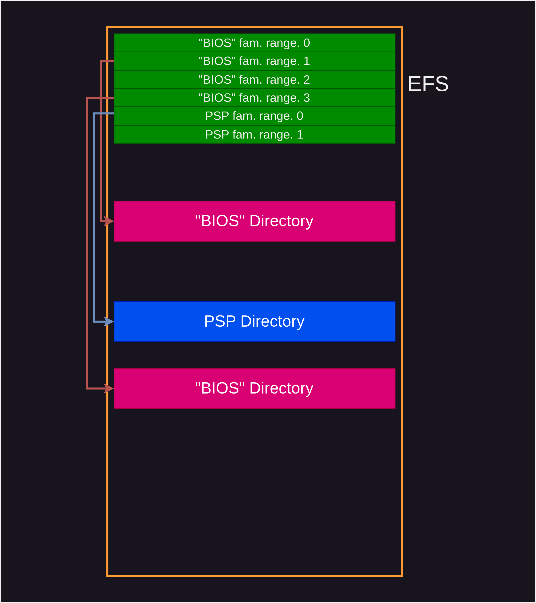

# AMD Firmware Image

The knowledge here stems in part from the existing Romulan code, plus other
sources, including:
- coreboot docs on
  * [Family 15h](https://doc.coreboot.org/soc/amd/family15h.html)
  * [Family 17h](https://doc.coreboot.org/soc/amd/family17h.html)
  * [PSP integration](https://doc.coreboot.org/soc/amd/psp_integration.html)
- coreboot code
  * [`util/amdfwtool`](https://github.com/coreboot/coreboot/tree/master/util/amdfwtool)
  * [`util/cbfstool/amdcompress.c`](https://github.com/coreboot/coreboot/tree/master/util/cbfstool)
- [PSPReverse](https://github.com/PSPReverse)
- [Fiano](https://github.com/linuxboot/fiano/)
- [Wikipedia](https://en.wikipedia.org/wiki/Table_of_AMD_processors)
- [Wikichip](https://en.wikichip.org/wiki/amd)
- [Mimoja's tools](https://github.com/Mimoja/amdfw)

For clarification, [AMD provides a short list of their own specific acronyms](
https://www.amd.com/content/dam/amd/en/documents/resources/glossary-of-terms.pdf).

## Embedded Firmware Structure (EFS)

This is the entry point to everything else, pointing to firmware for
- IMC (...)
- GbE (Gigabit ethernet)
- XHCI (USB ...)
- PSP (Arm; legacy and "modern")
- "BIOS" (x86; multiple, per family/model range)
- Promontory (two, one for low power)

It also contains a "second gen" flag plus SPI flash configuration per processor
family/model range.

Note that given a firmware image, you likely have firmware for multiple
processors/variants in it.

## PSP Firmware

The EFS has two pointers for PSP firmware:
1. legacy
2. "modern" (Fam 17 model 00 and later)

Those pointers may each lead to an immediate directory or a "combo" directory.
Combo directory entries themselves point to directories again.

### Combo Directory Entry

The first field tells whether the next one represents a PSP or SoC variant ID.
TODO: This may be related to BIOS Combo directories; to be figured out...

The PSP/SoC variant tells what processor family etc the combo entry is for.
Known variants in coreboot util/amdfwtool are incomplete.
There is no other public source as of now.

Multiple combo directory entries may refer to the same directory for different
variants of a processor that can run the same PSP code.

### How it works

Which code is being run and how it is selected will need to be determined by
the PSP mask ROM. In the case of immediate (non-combo) high level entries, it
may just take what's there and fail or bail out on error; needs investigation.

The platform boot flow starts with a lot happening on the PSP. Reworked from
[coreboot docs](https://doc.coreboot.org/soc/amd/family17h.html):

- System power on
- PSP executes immutable on-chip boot ROM
- PSP locates the Embedded Firmware Table and PSP Directory Table in the SPI ROM
- PSP verifies and executes the PSP off-chip bootloader
- (OEM specifics; omitted here)
- PSP parses the PSP Directory Table to find the ABLs and executes them
- An ABL parses the APCB for system configuration preferences
- An ABL
  1. initializes system main memory
  2. locates the compressed BIOS image in the SPI ROM
  3. decompresses it into DRAM
- An ABL writes the APOB to DRAM for consumption by the x86-based AGESA
- PSP releases the x86 processor from reset.

Finally, the x86 core fetches and executes instructions from the reset vector.

The terms used are explained in the coreboot docs. Briefly:
- Embedded Firmware Table probably means the EFS here
- ABL is AGESA bootloader
- APCB is AMD PSP Customization Block
- APOB is AMD PSP Ouput Buffer
